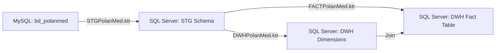

# Análisis ETL: PolanMed vs Alta Medica

## 1. Resumen Ejecutivo

Este documento analiza los archivos KTR de PolanMed y proporciona un mapeo detallado para implementar el ETL de Alta Medica siguiendo el mismo patrón.

---

## 2. Patrón ETL de PolanMed (Referencia)

### 2.1 Arquitectura de 3 Capas



### 2.2 Flujo de Datos PolanMed

**STGPolanMed.ktr:**
- `tb_Paciente` (MySQL) → Sort → `STG.tb_paciente` (SQL Server)
- `tb_medico` (MySQL) → Sort → `STG.tb_medico` (SQL Server)
- `tb_centroMedico` (MySQL) → Sort → `STG.tb_centromedico` (SQL Server)
- `tb_atencionmedica` (MySQL) → Sort → Select Values → `STG.tb_atencion` (SQL Server)

**DWHPolanMed.ktr:**
- `STG.tb_paciente` → `DWH.dimension_paciente`
- `STG.tb_medico` → `DWH.dimension_medico`
- `STG.tb_centromedico` → `DWH.dimension_centromedico`
- `STG.tb_atencion` → `DWH.dimension_tiempo` (generación de dimensión temporal)

**FACTPolanMed.ktr:**
- `STG.tb_atencion` + JOINs con dimensiones → `DWH.fact_atencion`

---

## 3. Esquema Alta Medica

### 3.1 Base de Datos Origen (MySQL: alta_medica_2025)

**Tablas Principales:**
- `paciente` (run, nombres, apellidos, fecha_nac, id_genero, grupo_sang, id_estado_salud, fono, email, direccion)
- `especialista` (run_especialista, id_area, id_estado_espec, nombres, apellidos, fono, email, direccion)
- `alta_medica` (id_alta_medica, run_paciente, run_especialista, id_hospitalizacion, tipo_formulario, numero_certificado, fecha_emision_certificado, id_calificacion, id_motivo_alta, fecha_alta, ...)
- `hospitalizacion` (id_hospitalizacion, run_paciente, run_especialista, id_camilla, id_estado_hospitalizacion, fecha_ingreso, fecha_real_alta)
- `registro_medico` (id_registro_med, run_paciente, run_especialista, fecha_hora_atencion, diagnostico, peso, altura)
- `examen` (id_examen, id_registro_med, id_tipo_examen, nombre_examen, resultado, fecha_examen)

**Tablas de Catálogo:**
- `genero`, `grupo_sanguineo`, `estado_salud`
- `area`, `estado_especialista`
- `catalogo_calificacion_alta`, `catalogo_motivo_alta`
- `tipo_camilla`, `camilla`, `estado_hospitalizacion`
- `tipo_alergia`, `alergia_paciente`
- `tipo_examen`, `estado_en_consulta`

### 3.2 Data Warehouse Destino (SQL Server: dwh_alta_medica)

**Esquema Estrella:**

**Dimensiones:**
1. `DWH.dim_paciente` (id_dim_paciente, run_paciente, nombre_completo, nombres, apellidos, fecha_nacimiento, edad, genero, grupo_sanguineo, estado_salud, telefono, correo, direccion)
2. `DWH.dim_especialista` (id_dim_especialista, run_especialista, nombre_completo, nombres, apellidos, especialidad, area_medica, estado, telefono, correo)
3. `DWH.dim_tiempo` (id_dim_tiempo, fecha, anio, mes, dia, trimestre, semestre, nombre_mes, nombre_dia, dia_semana, es_fin_semana, es_festivo)
4. `DWH.dim_tipo_alta` (id_dim_tipo_alta, tipo_formulario, calificacion, motivo_alta, categoria_motivo)
5. `DWH.dim_condicion` (id_dim_condicion, es_menor_edad, es_persona_mayor, tiene_discapacidad, tiene_dependencia, presume_invalidez, descripcion_condicion)
6. `DWH.dim_hospitalizacion` (id_dim_hospitalizacion, tipo_camilla, estado_hospitalizacion, categoria_motivo)

**Tabla de Hechos:**
- `DWH.fact_alta_medica` (id_fact, id_dim_paciente, id_dim_especialista, id_dim_tiempo, id_dim_tipo_alta, id_dim_condicion, id_dim_hospitalizacion, dias_hospitalizacion, edad_paciente_al_alta, dias_desde_emision_hasta_alta, tiene_hospitalizacion, tiene_responsable_legal, tiene_empleador, tiene_codigo_unico, tiene_diat_diep, numero_certificado, codigo_unico_nacional, fecha_emision, fecha_alta, fecha_diat_diep)

**Staging:**
- `STG.tb_paciente`
- `STG.tb_especialista`
- `STG.tb_tipo_alta`
- `STG.tb_condicion`
- `STG.tb_hospitalizacion`
- `STG.tb_alta_medica`

---

## 4. Mapeo Detallado: MySQL → Staging

### 4.1 STG.tb_paciente

**Query MySQL:**
```sql
SELECT 
    p.run as run_paciente,
    p.nombres,
    p.apellidos,
    p.fecha_nac as fecha_nacimiento,
    g.nombre_genero as genero,
    p.grupo_sang as grupo_sanguineo,
    es.nombre_estado_salud as estado_salud,
    p.fono as telefono,
    p.email as correo,
    p.direccion
FROM paciente p
LEFT JOIN genero g ON p.id_genero = g.id_genero
LEFT JOIN estado_salud es ON p.id_estado_salud = es.id_estado_salud
LEFT JOIN grupo_sanguineo gs ON p.grupo_sang = gs.nombre_grupo
ORDER BY p.run
```

**Transformaciones:**
- Ordenar por `run`
- Manejar NULLs en fecha_nacimiento (usar fecha por defecto si es NULL)

### 4.2 STG.tb_especialista

**Query MySQL:**
```sql
SELECT 
    e.run_especialista,
    e.nombres,
    e.apellidos,
    a.nombre_area as especialidad,
    a.nombre_area as area_medica,
    ee.nombre_estado as estado,
    e.fono as telefono,
    e.email as correo
FROM especialista e
INNER JOIN area a ON e.id_area = a.id_area
INNER JOIN estado_especialista ee ON e.id_estado_espec = ee.id_estado_espec
ORDER BY e.run_especialista
```

**Transformaciones:**
- Ordenar por `run_especialista`

### 4.3 STG.tb_alta_medica (Complejo)

**Query MySQL:**
```sql
SELECT 
    -- Claves de negocio
    am.run_paciente,
    am.run_especialista,
    
    -- Información del alta
    am.numero_certificado,
    am.codigo_unico_nacional,
    am.tipo_formulario,
    cca.nombre_calificacion as calificacion,
    cma.descripcion_motivo as motivo_alta,
    CASE 
        WHEN cma.descripcion_motivo LIKE '%recuper%' THEN 'Recuperación'
        WHEN cma.descripcion_motivo LIKE '%fallec%' THEN 'Fallecimiento'
        WHEN cma.descripcion_motivo LIKE '%traslad%' THEN 'Traslado'
        ELSE 'Otro'
    END as categoria_motivo,
    
    -- Condiciones del paciente
    am.es_menor_edad,
    am.persona_mayor as es_persona_mayor,
    am.discapacidad as tiene_discapacidad,
    am.dependencia_parcial_total as tiene_dependencia,
    am.presume_invalidez,
    CONCAT_WS(', ',
        CASE WHEN am.es_menor_edad = 1 THEN 'Menor de edad' END,
        CASE WHEN am.persona_mayor = 1 THEN 'Persona mayor' END,
        CASE WHEN am.discapacidad = 1 THEN 'Con discapacidad' END,
        CASE WHEN am.dependencia_parcial_total = 1 THEN 'Con dependencia' END,
        CASE WHEN am.presume_invalidez = 1 THEN 'Presume invalidez' END
    ) as descripcion_condicion,
    
    -- Información de hospitalización
    IFNULL(tc.nombre_tipo_camilla, 'Sin hospitalización') as tipo_camilla,
    IFNULL(eh.nombre_estado, 'N/A') as estado_hospitalizacion,
    CASE 
        WHEN h.motivo LIKE '%emerg%' THEN 'Emergencia'
        WHEN h.motivo LIKE '%program%' THEN 'Programada'
        ELSE 'Otro'
    END as categoria_motivo_hosp,
    
    -- Métricas
    IFNULL(DATEDIFF(h.fecha_real_alta, h.fecha_ingreso), 0) as dias_hospitalizacion,
    YEAR(am.fecha_alta) - YEAR(p.fecha_nac) - 
        (DATE_FORMAT(am.fecha_alta, '%m%d') < DATE_FORMAT(p.fecha_nac, '%m%d')) as edad_paciente_al_alta,
    
    -- Indicadores
    CASE WHEN am.id_hospitalizacion IS NOT NULL THEN 1 ELSE 0 END as tiene_hospitalizacion,
    CASE WHEN am.resp_legal_rut IS NOT NULL THEN 1 ELSE 0 END as tiene_responsable_legal,
    CASE WHEN am.empleador_rut IS NOT NULL THEN 1 ELSE 0 END as tiene_empleador,
    CASE WHEN am.codigo_unico_nacional IS NOT NULL THEN 1 ELSE 0 END as tiene_codigo_unico,
    CASE WHEN am.fecha_diat_diep IS NOT NULL THEN 1 ELSE 0 END as tiene_diat_diep,
    
    -- Fechas
    am.fecha_emision_certificado as fecha_emision,
    am.fecha_alta,
    am.fecha_diat_diep

FROM alta_medica am
INNER JOIN paciente p ON am.run_paciente = p.run
INNER JOIN especialista e ON am.run_especialista = e.run_especialista
LEFT JOIN hospitalizacion h ON am.id_hospitalizacion = h.id_hospitalizacion
LEFT JOIN camilla c ON h.id_camilla = c.id_camilla
LEFT JOIN tipo_camilla tc ON c.id_tipo_camilla = tc.id_tipo_camilla
LEFT JOIN estado_hospitalizacion eh ON h.id_estado_hospitalizacion = eh.id_estado_hosp
LEFT JOIN catalogo_calificacion_alta cca ON am.id_calificacion = cca.id_calificacion
LEFT JOIN catalogo_motivo_alta cma ON am.id_motivo_alta = cma.id_motivo_alta
ORDER BY am.id_alta_medica
```

**Transformaciones en Pentaho:**
- **Calculator Step**: Calcular `dias_desde_emision_hasta_alta` = fecha_alta - fecha_emision
- **Select Values**: Seleccionar solo los campos necesarios
- **Filter Rows**: Opcional - filtrar registros inválidos

---

## 5. Mapeo: Staging → Dimensiones

### 5.1 dim_paciente

**Source:** `STG.tb_paciente`

**Transformaciones:**
```javascript
// Calculator: nombre_completo
nombre_completo = nombres + " " + apellidos

// Calculator: edad
edad = YEAR(CURRENT_DATE) - YEAR(fecha_nacimiento) - 
       (MONTH(CURRENT_DATE) < MONTH(fecha_nacimiento) OR 
        (MONTH(CURRENT_DATE) = MONTH(fecha_nacimiento) AND 
         DAY(CURRENT_DATE) < DAY(fecha_nacimiento)) ? 1 : 0)
```

**Target:** `DWH.dim_paciente`

### 5.2 dim_especialista

**Source:** `STG.tb_especialista`

**Transformaciones:**
```javascript
// Calculator: nombre_completo
nombre_completo = nombres + " " + apellidos
```

**Target:** `DWH.dim_especialista`

### 5.3 dim_tiempo

**Source:** `STG.tb_alta_medica` (DISTINCT fechas)

**Query:**
```sql
SELECT DISTINCT fecha_alta as fecha FROM STG.tb_alta_medica
UNION
SELECT DISTINCT fecha_emision FROM STG.tb_alta_medica
UNION
SELECT DISTINCT fecha_diat_diep FROM STG.tb_alta_medica WHERE fecha_diat_diep IS NOT NULL
```

**Transformaciones:**
```javascript
// Extraer componentes de fecha
anio = YEAR(fecha)
mes = MONTH(fecha)
dia = DAY(fecha)
dia_semana = DAYOFWEEK(fecha)  // 1=Domingo, 7=Sábado

// Calcular trimestre y semestre
trimestre = CEIL(mes / 3.0)
semestre = CEIL(mes / 6.0)

// Nombres en español
nombre_mes = CASE mes
    WHEN 1 THEN 'Enero'
    WHEN 2 THEN 'Febrero'
    WHEN 3 THEN 'Marzo'
    WHEN 4 THEN 'Abril'
    WHEN 5 THEN 'Mayo'
    WHEN 6 THEN 'Junio'
    WHEN 7 THEN 'Julio'
    WHEN 8 THEN 'Agosto'
    WHEN 9 THEN 'Septiembre'
    WHEN 10 THEN 'Octubre'
    WHEN 11 THEN 'Noviembre'
    WHEN 12 THEN 'Diciembre'
END

nombre_dia = CASE dia_semana
    WHEN 1 THEN 'Domingo'
    WHEN 2 THEN 'Lunes'
    WHEN 3 THEN 'Martes'
    WHEN 4 THEN 'Miércoles'
    WHEN 5 THEN 'Jueves'
    WHEN 6 THEN 'Viernes'
    WHEN 7 THEN 'Sábado'
END

// Indicadores
es_fin_semana = (dia_semana = 1 OR dia_semana = 7) ? 1 : 0
es_festivo = 0  // Por defecto, se puede mejorar con tabla de festivos
```

**Target:** `DWH.dim_tiempo`

### 5.4 dim_tipo_alta

**Source:** `STG.tb_alta_medica` (DISTINCT)

**Query:**
```sql
SELECT DISTINCT 
    tipo_formulario,
    calificacion,
    motivo_alta,
    categoria_motivo
FROM STG.tb_alta_medica
```

**Target:** `DWH.dim_tipo_alta`

### 5.5 dim_condicion

**Source:** `STG.tb_alta_medica` (DISTINCT)

**Query:**
```sql
SELECT DISTINCT 
    es_menor_edad,
    es_persona_mayor,
    tiene_discapacidad,
    tiene_dependencia,
    presume_invalidez,
    descripcion_condicion
FROM STG.tb_alta_medica
```

**Target:** `DWH.dim_condicion`

### 5.6 dim_hospitalizacion

**Source:** `STG.tb_alta_medica` (DISTINCT)

**Query:**
```sql
SELECT DISTINCT 
    tipo_camilla,
    estado_hospitalizacion,
    categoria_motivo_hosp as categoria_motivo
FROM STG.tb_alta_medica
WHERE tiene_hospitalizacion = 1
```

**Target:** `DWH.dim_hospitalizacion`

---

## 6. Mapeo: Staging + Dimensions → Fact Table

### 6.1 fact_alta_medica

**Source:** `STG.tb_alta_medica`

**Database Lookups (para obtener claves surrogadas):**

1. **Lookup id_dim_paciente:**
   ```sql
   SELECT id_dim_paciente 
   FROM DWH.dim_paciente 
   WHERE run_paciente = ?
   ```

2. **Lookup id_dim_especialista:**
   ```sql
   SELECT id_dim_especialista 
   FROM DWH.dim_especialista 
   WHERE run_especialista = ?
   ```

3. **Lookup id_dim_tiempo:**
   ```sql
   SELECT id_dim_tiempo 
   FROM DWH.dim_tiempo 
   WHERE fecha = ?  -- fecha_alta
   ```

4. **Lookup id_dim_tipo_alta:**
   ```sql
   SELECT id_dim_tipo_alta 
   FROM DWH.dim_tipo_alta 
   WHERE tipo_formulario = ?
     AND calificacion = ?
     AND motivo_alta = ?
     AND categoria_motivo = ?
   ```

5. **Lookup id_dim_condicion:**
   ```sql
   SELECT id_dim_condicion 
   FROM DWH.dim_condicion 
   WHERE es_menor_edad = ?
     AND es_persona_mayor = ?
     AND tiene_discapacidad = ?
     AND tiene_dependencia = ?
     AND presume_invalidez = ?
   ```

6. **Lookup id_dim_hospitalizacion:**
   ```sql
   SELECT id_dim_hospitalizacion 
   FROM DWH.dim_hospitalizacion 
   WHERE tipo_camilla = ?
     AND estado_hospitalizacion = ?
     AND categoria_motivo = ?
   ```

**Target Fields:**
- id_dim_paciente (from lookup)
- id_dim_especialista (from lookup)
- id_dim_tiempo (from lookup)
- id_dim_tipo_alta (from lookup)
- id_dim_condicion (from lookup)
- id_dim_hospitalizacion (from lookup, puede ser NULL)
- dias_hospitalizacion (from staging)
- edad_paciente_al_alta (from staging)
- dias_desde_emision_hasta_alta (calculated: fecha_alta - fecha_emision)
- tiene_hospitalizacion (from staging)
- tiene_responsable_legal (from staging)
- tiene_empleador (from staging)
- tiene_codigo_unico (from staging)
- tiene_diat_diep (from staging)
- numero_certificado (from staging)
- codigo_unico_nacional (from staging)
- fecha_emision (from staging)
- fecha_alta (from staging)
- fecha_diat_diep (from staging)

**Target:** `DWH.fact_alta_medica`

---

## 7. Comparación: PolanMed vs Alta Medica

| Aspecto | PolanMed | Alta Medica |
|---------|----------|-------------|
| **Origen** | MySQL: bd_polanmed | MySQL: alta_medica_2025 |
| **Destino** | SQL Server: dwh_polanmed | SQL Server: dwh_alta_medica |
| **Dimensiones** | 4 (Paciente, Médico, Centro, Tiempo) | 6 (Paciente, Especialista, Tiempo, Tipo Alta, Condición, Hospitalización) |
| **Fact Table** | fact_atencion (atenciones médicas) | fact_alta_medica (altas médicas) |
| **Complejidad Staging** | Simple (4 tablas) | Compleja (6 tablas, con cálculos) |
| **Transformaciones** | Mínimas (sort, select) | Extensas (calculators, case statements) |
| **Métricas** | Básicas | Avanzadas (días, edades, indicadores) |

---

## 8. Recomendaciones de Implementación

### 8.1 Orden de Ejecución

1. **Primero:** `STG_Alta_Medica.ktr` (poblar staging)
2. **Segundo:** `DWH_Alta_Medica.ktr` (poblar dimensiones)
3. **Tercero:** `FACT_Alta_Medica.ktr` (poblar fact table)

### 8.2 Manejo de Errores

- **NULLs en fechas**: Usar fecha por defecto (ej: '1900-01-01')
- **Lookups fallidos**: Configurar "Default value" en Database Lookup steps
- **Duplicados en dimensiones**: Usar "INSERT OR UPDATE" en Table Output

### 8.3 Optimizaciones

- **Batch Size**: Configurar commit size en 1000 registros
- **Índices**: Asegurar que existen índices en campos de lookup
- **Truncate**: NO truncar dimensiones (modo append), SÍ truncar staging antes de cada ejecución

### 8.4 Validaciones

Después de cada ejecución, verificar:
```sql
-- Contar registros en cada capa
SELECT 'Staging Paciente' as tabla, COUNT(*) FROM STG.tb_paciente
UNION ALL
SELECT 'Dim Paciente', COUNT(*) FROM DWH.dim_paciente
UNION ALL
SELECT 'Fact Alta Medica', COUNT(*) FROM DWH.fact_alta_medica;

-- Verificar integridad referencial
SELECT COUNT(*) as registros_huerfanos
FROM DWH.fact_alta_medica f
WHERE NOT EXISTS (
    SELECT 1 FROM DWH.dim_paciente p 
    WHERE p.id_dim_paciente = f.id_dim_paciente
);
```

---

## 9. Conclusión

El patrón ETL de PolanMed proporciona una arquitectura sólida de 3 capas (Staging → Dimensions → Fact) que se puede adaptar perfectamente a Alta Medica. La principal diferencia radica en la complejidad del modelo de datos y la cantidad de transformaciones necesarias, pero el flujo general se mantiene idéntico.
